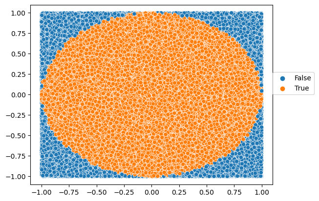

# Estimating Pi
Approximating value of Pi using Monte Carlo Simulation.

# Method 

 
> Slide Source: MIT OCW  
> MIT 6.0002 Introduction to Computational Thinking and Data Science, Fall 2016 
> Check out the [MIT OCW Lecture 7](https://youtu.be/rUxP7TM8-wo?si=i0Nu38gDe6LH4R91)

---

# Results
1. Pi Estimation Formula: 
$$
\pi \approx 4 \cdot \frac{\text{points in circle}}{\text{total points}}
$$

2. Pi Estimation Plot: 

3. Pi Value: 
$$
\pi \approx 3.141836
$$

---